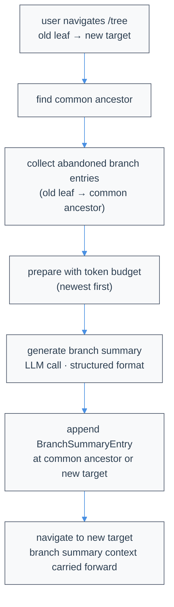

# Compaction engine

Relocated mechanics from `packages/coding-agent/docs/compaction.md` and `compaction/reference.md`. Public parameters, hooks, entry schemas, examples, and operator recovery guidance remain in those pages.

## Planning and reconstruction

The planner receives role-tagged transcript lines numbered `N→content` and emits unsigned, one-based inclusive `start,end` records without brackets or prose. Reconstruction swaps reversed endpoints, clamps to the transcript, sorts, merges overlap/adjacency, and splits around protected spans. Retained non-marker lines are byte-identical and ordered as in the input. Role headers are ordinary rankable lines.

Deleted spans become `(filtered N lines)`, always plural. Repeated compaction folds swallowed and adjacent old markers into cumulative counts. The next request ranks the prior durable summary plus all active ordinary messages except the exact protected tail. Compactable images become `[image]`; compactable tool text is capped at 16,000 characters with a truncation marker.

`keepContext` tag lines are protected too, so spans are detected again on later boundaries. Deletion ranges are split around them after planning, even if the model ignored its instructions. Tags must occupy a whole line after a role header and cannot extend beyond their message. Tool-result tags are inert so fetched material cannot make itself unreclaimable. The protection floor does not increase the keep target.

Each request ranks the whole eligible region in one pass, with a keep target derived from `compression_ratio`; no chunking or caller output cap is used. Reasoning inherits the session level unless the fallback entry has a `model:level` suffix. Provider context clamping still applies.

Typed outcomes are `ranked`, `recovered`, `overflowed`, `rateLimited`, `unusable`, and `providerError`. Successful rankings and recovered records commit `rung: "planned"`. Overflow classification precedes parsing, including `stop` or `length` completions whose reported usage exceeds the window. Overflow retries halve the suffix until no smaller view remains; withheld head lines become deterministic deletions. Each smaller view derives a new keep target, avoiding an impossible zero-deletion request. The planner validates ranges before returning and the runner validates again before persistence.

`rate_limited` includes 429, overloaded, and all HTTP 5xx responses. `quota` covers billing and usage exhaustion, including `The usage limit has been reached`. These classifications deliberately exceed pi-ai's retry tables. `exhausted` and diagnostic `rateLimitExhausted` report observed retry scheduling, not an assumed budget; quota and disabled/zero retries report false. `unusable` includes malformed output, zero safe ranges, and reasoning starvation (`starved`). Other provider/transport errors advance the ladder too.

Missing credentials mark a candidate attempted without a request. Fallbacks resolve their own credentials. Retry settings govern transport attempts within a candidate. The fallback list is traversed once, in order, keyed by `provider/model:thinkingLevel`, including unresolved, duplicate, or unauthenticated entries. Registry changes cannot rewind it.

Borrowing writes no `agent.state.model`, model/thinking history, system prompt, or main-chat fallback bookkeeping. It emits no `model_changed`, `model_select`, or `model_fallback_start`, and calls no `agent.continue()`.

Manual and ordinary threshold calls are recoverable: exhaustion writes no boundary or continuation and reports the cause through `compaction_end`. `session.compact()` projects only permitted parameters, so caller objects cannot elevate urgency to `load_bearing`. Overflow and post-tool preflight may use the fresh rung. Valid usable rankings are accepted once even below the requested reduction; no deletions are added or restored to force a target.

## Fresh context and turn integration

`startNewContextWindow` needs no provider, credentials, or network. It discards the compactable region and previous summary while keeping protected spans and the recent tail. Only a tail that alone exceeds the provider hard input limit is dropped, with `firstKeptEntryId: null`. It uses the ordinary validation/reconstruction path with the region as one deletion range.

Below-minimum regions reach this rung only when known not to fit. A post-tool threshold crossing that still fits is a no-op. After compaction the hard-input gate can still refuse the next request; `compaction_end.result` and `errorMessage` are independent, so a committed boundary remains visible before the failure status.

The post-tool ladder runs once inside the active Pi loop, returning rebuilt context without scheduling `agent.continue()` or another `agent_start`. The TUI swaps the compaction loader for its working spinner and retains terminal progress. Below-threshold requests are unchanged. Caller `prepareNextTurn`/`prepareNextTurnWithContext` run on rebuilt context before the normal transform. `shouldStopAfterTurn: true` wins over queued input, including input arriving during the callback.

Manual calls share one in-flight run, event pair, and boundary; abort cancels it for all waiters. Manual takeover cancels unfinished automatic work and its continuation, waits for settlement, then starts the manual run. A committed automatic boundary is not reused. The TUI refuses a second manual compaction or branch summary. Non-mid-turn completion, cancellation, and failure release ordinary queued input. An independent RPC control lane carries cancellation and UI responses while `compact` is pending. Backup snapshots precede boundary append.

## Truncated planner responses

Only newline-terminated records may be recovered from `stopReason: "length"`. The final fragment is always discarded: even `300,30` may be a cut-off `300,305`. Any malformed complete line or zero validated ranges makes the attempt unusable. The planner orders ranges by descending deletion confidence so useful deletions survive a cut.

Verbatim example relocated from `compaction.md`, Length-truncated response recovery:

```text
120,180
6,40
300,
```

Recovery keeps `120,180` and `6,40`, not `300,`. Successful recovery has the normal compaction UI. A private `0600` recovery sidecar records raw response, stop reason, usage including `usage.reasoning`, absent request `maxTokens`, model metadata, recovered count, and category. Its path is not shown on success. In-memory sessions and write failures do not affect recovery.

## Diagnostic records and token estimates

Failed attempts write distinct JSON sidecars beside persisted session JSONL. `RangePlanError` carries the path after recoverable exhaustion. Records include response, stop reason, provider error, usage, absent `maxTokens`, timestamp, category, and non-secret metadata for the attempted model. They omit keys, request headers, prompt, and numbered request transcript, but echoed input can still be sensitive.

Categories distinguish malformed output, no usable ranges, provider/stream errors, `starved`, `rate_limited`, `quota`, and `context_overflow`. A borrowed-model success writes `<session>-compaction-success-<timestamp>-<id>.json` with model and thinking level. Exclusive creation plus timestamps and per-attempt IDs prevent same-millisecond overwrites. No sidecars are created for in-memory sessions; write failure preserves the original outcome classification.

OpenAI Responses, Codex Responses, and Completions normalize uncached input plus cache-read/cache-write. Anthropic Messages alone uses the mirrored-cache guard for compatible endpoints duplicating prompt counts. Entry `tokensBefore` drives budgeting/display. `stats.tokensBefore`, `stats.tokensAfter`, and `percentReduction` symmetrically estimate region plus tail and can report negative reduction.

## Boundary reconstruction and historical formats

The tail may start/end mid-turn. It is serialized with the region grammar and concatenated to the durable summary in one custom-role boundary, converted to a user-role provider message. Tail tool results retain full text; images remain attached image blocks. This avoids out-of-order assistant/tool-result blocks. Messages appended afterward remain structured messages. With no retained tail, the boundary contains summary alone.

This serialization resets signed thinking at the boundary without a separate stripping pass. It implements the keep-text/tool-calls remedy rather than replaying signed thinking blocks. Between-boundary model switches are a separate concern.

Only `details.strategy === "verbatim-lines"` activates a compaction entry. Old `context_compaction` logical deletions and old prose `compaction` records remain parseable but inert; their omissions are not replayed on resume. No session-format bump or new entry type was needed. `rung` and `plannerModel` are additive. Existing string `firstKeptEntryId` records keep their resume behavior.

Atomic's `preserve_recent` is an exact message count, unlike upstream `keepRecentTokens`. `compression_ratio`, `query`, and `enabled` remain ordinary settings. The query is never truncated, so later structured-prompt sections can still influence ranking; an oversized request surfaces as provider overflow rather than silent query loss.

## Branch summaries and request isolation

Branch summarization finds the common ancestor, walks the abandoned leaf back to it, budgets newest entries first, calls the model with tools disabled, rejects tool calls and `length` prose, and appends `BranchSummaryEntry`. File tracking combines current tool operations with prior summary details. Implementation entry points are `collectEntriesForBranchSummary()`, `prepareBranchEntries()`, and `generateBranchSummary()` in `packages/coding-agent/src/core/compaction/branch-summarization.ts`.

`serializeConversation()` in `compaction/utils.ts` role-tags text to prevent treating it as conversation to continue; branch-summary tool results are capped at 2000 characters with an omitted-character marker.

Planning and branch/session summaries use fresh routing session IDs and `cacheRetention: "none"`, not the chat's affinity/cache. Requests set `toolChoice: "none"`, reject returned tools, and send no `max_tokens`. Only deletion planning recovers truncated complete records. API-key, header-only `ANTHROPIC_AUTH_TOKEN`, custom headers, abort, and bounded retry still apply; success follows normal persistence. A borrowed model uses its own key, headers, and base URL, never the session provider's credentials.

The branch algorithm diagram moved verbatim from `compaction.md`, How It Works. The user-facing before/after tree remains there.


