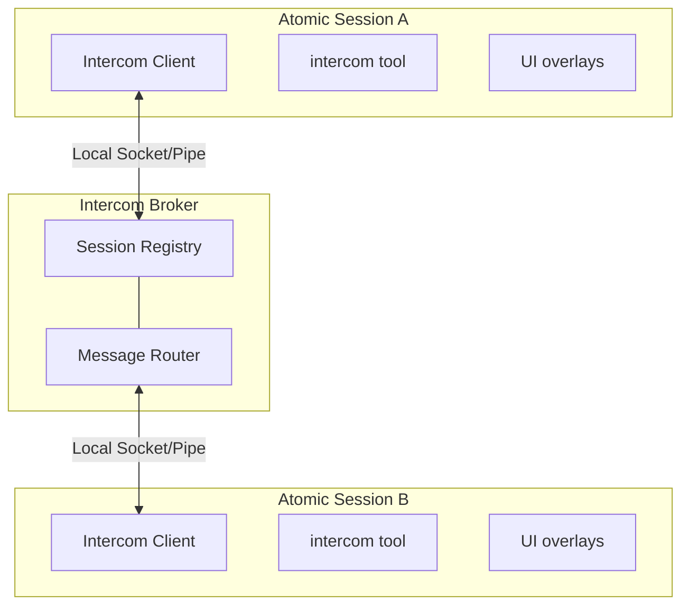

# Intercom broker and delivery authority

Relocated from `packages/coding-agent/docs/intercom/operations.md` (connection, How It Works, and delivery ordering), `intercom/reference.md` (supervisor and launcher mechanics), and `intercom.md` (typed child admission). Tool contracts, public examples, and operator recovery instructions remain in those pages.

## Connections and recovery ownership

Lightweight wrappers load at session startup; heavy module import/connection is shared across concurrent first-use callers and leased to the session generation. Shutdown/replacement cleans it up. Parent supervisor authorization can connect before ordinary first use to mint an exact-child capability; the child remains lazy. The parent restores capabilities after reconnect and the child uses the broker-confirmed supervisor ID.

The detached broker starts on demand and exits five seconds after no registrations remain, including startup with no connection and sockets closed before registration. A PID/timestamp spawn lock prevents duplicate brokers. Failed accepted reconnects close their connection before retry so list rows are not duplicated. Backoff is 1, 2, 5, 10, then 30 seconds until connection or shutdown.

Recoverable disconnects surface only to waiting callers. Background stage warm-up, subagent/pending-stage relays, and advisory supervisor authorization retain recovery ownership rather than failing a stage; advisory launch can omit supervisor metadata. The heavy module owns reconnects after import; before import, the wrapper retries warm-up on the bounded schedule.

Warm-up exhaustion calls required `WorkflowPendingStageDelivery.fail(reason)`. The stage emits a scoped failure naming run/stage ID/name; `ready()` settles once, without raw extension console text in the root transcript. Queued messages remain unconsumed and later drains no-op. Empty queues short-circuit normally. `ready()` itself has no timeout, which makes an explicit terminal owner mandatory. The delivery error is not a model failure: no same-model retry or fallback is spent. Classification uses type, and the original reason is a `reason` property rather than `cause` to avoid the model network classifier.

Registered-socket `ECONNRESET`/`EPIPE` are recoverable disconnects with the original transport error as cause. Framing/protocol errors retain `Intercom protocol error: …` even if a socket error follows. Pre-registration failures are not reclassified. Authentication, configuration, protocol, nonrecoverable initialization, and terminal relay failures remain visible.

## Operation identity

One send/ask/reply invocation owns the initial attempt and up to three retries at 1, 2, and 5 seconds. It retains message ID, arguments, ordered attachments with presence, and reply thread. No public retry token is accepted. Initialization/replay has its own three reconnect retries before delivery; exhaustion/cancellation there is `not_sent` and never retries executed delivery.

Only typed recoverable disconnects start recovery. Subsequent nondelivery or uncertain/capacity-bound authority retains identity; delivered/queued success ends retries, unrelated errors stop them. The original 11-minute operation deadline bounds retries and reply waiting. Cancellation stops new attempts but cannot undo a success receipt. Unestablished outcomes and accepted asks without replies end as `unknown`, never permission to resend automatically.

Broker authority persists for 12 minutes in `delivered-messages.sqlite`. Canonical payload signatures are not stored; fixed 32-byte hex SHA-256 HMAC digests use the paired random `delivered-messages.key`. Stable keys across replacement prevent duplicate delivery without exposing text or permitting offline guesses to readers lacking the key. POSIX corrects the directory to `0700` and database/WAL/SHM/key to `0600`; Windows retains platform permissions. Missing/malformed pairs, digest records, or truncated authority fail closed.

Identity is reserved durably before forwarding, then accepted after confirmed socket write and before sender acknowledgement. Accepted crashes can return retained success; pre-forward reservations are uncertain. Deduplicated ask replies first use the exact recorded sender while live. Only after departure may name/stable-route reconnection resolution run. Ambiguity or changed endpoint, groups, payload, or ID refuses delivery. Implicit reply retry retains its original sender/question route; explicit `to` remains caller-controlled and `requirePendingReply` stays mandatory. Legacy frames retain transport-target semantics.

A client reserves one of 1,000 identity slots before ID consumption, confirmation, or target resolution. Existing retries work at capacity; confirmation occurs once. Invocation completion/expiry releases client state, not broker records. The broker caps live authority at 10,000 records and 64 MiB; TTL cleanup frees space rather than evicting duplicate-suppression authority. The local result relay also reserves before its chat effect and accepts before acknowledgement; it refuses the 10,001st live ID and uncertain replay. SQLite transactions serialize access.

## Transport and process launch

IPC is Unix sockets on macOS/Linux and named pipes on Windows. Frames are four-byte length-prefixed JSON. Session-list requests correlate; malformed/out-of-order frames and delivery failures are validated. `ask` waiting is client-side; the broker routes ordinary messages.

Retire a session when its socket ceases to be writable, not only on close. Half-closed peers previously remained in routing and caused repeated failed broadcasts/log floods. Every write checks writability; delivery waits for its callback so immediate async reset cannot count as success. Failure returns `Session not found`, retains retryability, and opens no reply authorization.

Custom registration/roster `recipientPurpose` accepts only `agent` or `control`; omission means agent. Invalid strings, null, and other types reject. Purpose is immutable, and roster updates await a broker round trip before discovery.

Runtime files under the active agent directory's `intercom/` are `broker.sock`, Windows `broker-launch.vbs`, `broker.pid`, `broker.spawn.lock`, `broker.log`, `delivered-messages.sqlite`, `delivered-messages.key`, and `config.json`. `ATOMIC_CODING_AGENT_DIR` wins over legacy `PI_CODING_AGENT_DIR`.

The detached broker resolves only Node built-ins and its own files, not the host's module graph. Default `npx --no-install tsx` is a compatibility sentinel, never a PATH lookup: Node uses `process.execPath` with bundled pure-JavaScript jiti; Bun checkouts use current Bun; standalone binaries use their internal broker handoff. Explicit custom commands still use their configured executable.

## Bounded stderr

The parent passes an open file descriptor on a freshly truncated `broker.log`, not a pipe, because the broker outlives it. Early-exit/readiness errors quote the path and bounded tail; Windows hidden launch redirects to the same file.

The broker's first import installs an 8 KiB cap before dependencies evaluate. It covers `process.stderr.write`, `console.error`/`console.warn`, and default fatal exception/rejection printing. Stream patching alone misses Bun console's direct descriptor writes and fatal output. Excess is discarded on direct and Windows launches. The cap cannot cover pre-import runtime/loader output, native writes to fd 2, broker children, or hard termination. The broker graph has no native-addon or child-process edge.

## Supervisor and completion routing

Typed child admission binds supervisor, canonical child identity, index, session name, and capability in process, never from environment. The broker validates supervisor markers; forged ordinary sends stay membership-isolated. Replies cross groups only through recorded exact `replyTo`. Parent-held authorization restores on reconnect. Claimed single-child decisions/interviews terminate before broker send/waiter admission; parallel requests wait for correlated replies. Claimed provider failure aborts launch; runtimes without a provider omit supervisor metadata.

Parallel asks/sends/supervisor requests reserve at the destination and use an exact-child probe/commit observation-yield handshake before priority cancellation. It releases the parent's wait, not child execution capacity; terminal close cannot overtake admission. Targeted/batch/owner cancellation stays separate. Detached delivery preserves confirmed phase across watcher replacement; deterministic targets derive from run/agent/index.

Completion outboxes drain already-queued messages from the trusted child run/target before its terminal notice. Earlier messages retain separate admission IDs; completion has its own ID. Other children and pending asks are independent. Failure retries delivery without changing task outcome or rerunning work. Restored completions without live bindings deliver without guessing a child identity. Async startup, flushes, reconnects, overlays, and relays no-op after shutdown/reload.

## Broker topology

Diagram moved verbatim from `intercom/operations.md`, How It Works.

